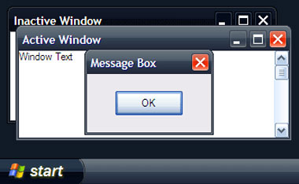
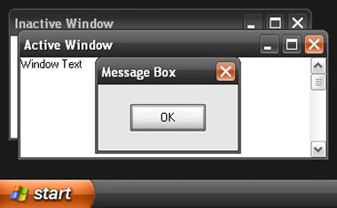
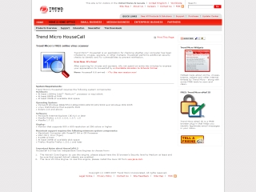

From time to time it's fun to give your computer an overhaul. Here's a few simple, and not-so-simple ways rejuvinate your humdrum old Windows machine. And I'm assuming that we're using Windows XP here - not ole' Vista.

### #1 A New theme!

You mightn't like Vista, but I challenge you to say that the glassy Vista styles aren't a million times nicer than the playdough style default XP ones. Microsoft it seems, missed a potential killer market by locking down the Windows themes to only Microsoft-certified ones. (Probably because they knew of hundreds of critical security flaws.)

Better late than never, the theme Royale appeared with Windows 2006 Media Center edition, and then later in the year the half-completed Royale Noir emerged. And with the release of the Zune, Microsoft released a 'final' version of the Royale Noir theme, entitled... well, 'Zune'. You might think that's the end of it, but no. A few modders have taken the Royale Noir theme on a bit - not happy with the unfinished Noir, or the Orangeness of the Zune, they've released a theme called Royale Remixed, which contains all three themes, with a few nice touchups. Even better, these themes upgrade your window skins, Outlook skins, and transforms your mouse cursor to the nice shiny Vista versions.

*   You can get the [Microsoft Zune theme installer here](go.microsoft.com/fwlink/?LinkID=75078 "Open link in a new window"). This will install the Zune theme in one click.

*   [Download the Royale Noir files here](http://www.softpedia.com/get/Desktop-Enhancements/Themes/Royale-Noir-Theme.shtml "Open link in a new window"). It comes with a Readme file which tells you where to copy the files, and also installs the basic Royale theme (the same as comes with Windows Media Center) at the same time.

*   Being a non-Microsoft product, the Royale Remixed theme requires a patch to one of the windows core dll's - to allow unsigned graphics. [Get the patch from here](http://www.softpedia.com/get/System/OS-Enhancements/UXTheme-MultiPatcher.shtml "Open link in a new window"), and then download the [Royale Remixed theme installer from here](http://oddbasket.deviantart.com/art/Royale-Remixed-44294818 "Open link in a new window"). If you're having trouble with this, there's a nice tutorial / walkthrough on the patching process [here](http://www.zune-online.com/news/zune/zune-multicolor-theme-for-windows.html "Open link in a new window").

### #2 Viruscan!

It's a perfect opportunity to go bug-hunting, and even if you don't have a virus-scanner, there's a particulary good (albeit depressingly slow) virus-scanner available online at [TrendMicro](http://housecall.trendmicro.com/ "Open link in a new window"). (Housecall 6.5) This is one to do overnight really, but you can be sure that it'll isolate any little beasties or suspious programs you've caught since your last check. Peace of mind, n'all?

### #3 Dump your old stuff.

How you do this is up to you, but I like to jump straight into msconfig (Start > Run > "msconfig"). From there you can quickly surf through the various Services and Startup applications. This should carry a 'Do this at your own risk' warning... you could seriously mess your computer up if you start playing too much. Generally I disable any services I don't actually need, like Acrobat Reader Quickstarter, Office Quickstarter, Adobe Bridge and Display Driver configuration applications. Beware of disabling anything that's got the Manufacturer listed as Microsoft - those tend to be important to Windows itself. Lookup anything you're not sure of. Google is quite good finding information about 'what this is' or 'what that is'.

Alternatively, if you're feeling wimpy, you can just go through all of your startup applications and try modifying their settings so they don't launch at startup.

All in all, this should give you a nice performance upgrade, which is perfect for what's next...

### #4 Get some new stuff!

That's right, now's the fun part. New toys! There are a few programs I reccommend you get, if you haven't already. [Picassa](http://picasa.google.com/ "Open link in a new window"). [Foxit Reader](http://www.foxitsoftware.com/pdf/rd_intro.php "Open link in a new window"). [ZoneAlarm](http://www.zonealarm.com/store/content/catalog/products/sku_list_za.jsp?dc=56pus&ctry=GB&lang=en "Open link in a new window"). [Launchy](http://www.launchy.net/#download "Open link in a new window"). [Media Player Classic](http://en.wikipedia.org/wiki/Media_Player_Classic "Open link in a new window"). And - if you've got a PS3 or XBOX 360 - [TVersity Media Server](http://tversity.com/home "Open link in a new window").

All of these are free, and perform their tasks admirably.

*   [**Picassa**](http://picasa.google.com/ "Open link in a new window"), part of the Google Pack (which might also contain some more useful tools for you) isn't just the poor man's Photoshop, it's pretty much one of the easiest-to-use photo collection / correction tools around, pretty slick and lightweight too.
*   [**Foxit Reader**](http://www.foxitsoftware.com/pdf/rd_intro.php "Open link in a new window") \- a PDF Reader and an alternative to Adobe Acrobat Reader - weighs in at approximately 2meg, and is lightning fast, with out constantly trying to download massive incremental updates without grinding your computer to a halt whenever you try using it.
*   [**ZoneAlarm**](http://www.zonealarm.com/store/content/catalog/products/sku_list_za.jsp?dc=56pus&ctry=GB&lang=en "Open link in a new window"), a free and incredibly effective firewall practically negates the need for a constant virus-scanner like Norton Antivirus, so long as you don't do anything stupid. Without constant computer monitoring of a virus-scanner you'll zip along, happily protected by your inpenitrable* - and quite informative - firewall.
*   [**Launchy**](http://www.launchy.net/#download "Open link in a new window"). The premise is that it 'knows' everything on your computer. Every file, every application. Open the program with a key combination and start typing part of the file / application name. It'll show you what it thinks you're looking for, and then you can launch it with the enterkey. Sound similar to Google Desktop? Yes it is, but its' sooo much more practical. And configurable too.
*   [**Media Player Classic**](http://en.wikipedia.org/wiki/Media_Player_Classic "Open link in a new window"). This is a single, lightweight, no-frills application, that plays just about every media format. You can forget about messing around trying to find the most appropriate video software, and just use this.
*   [**TVersity Media Server**](http://tversity.com/home "Open link in a new window") is here because it's cool. Essentially it's a media distribution server, in the same way that Apache is a http webserver. With another compatable device - say, you're wirelessly linked PS3 downstairs - you can stream your iTunes music, view your digital camera photos and watch those hilarious saved YouTube movies on your PS3. As far as toys go, this one is brilliant. (But only if you've got a compable console set up on your network.)