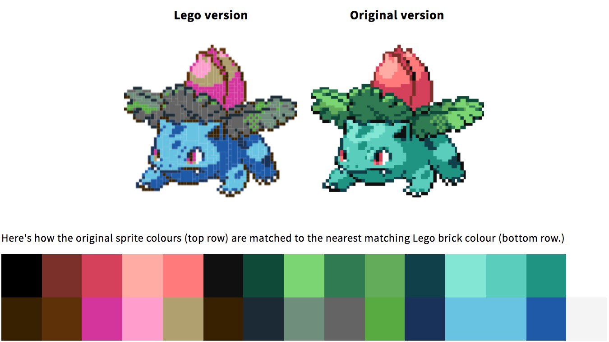
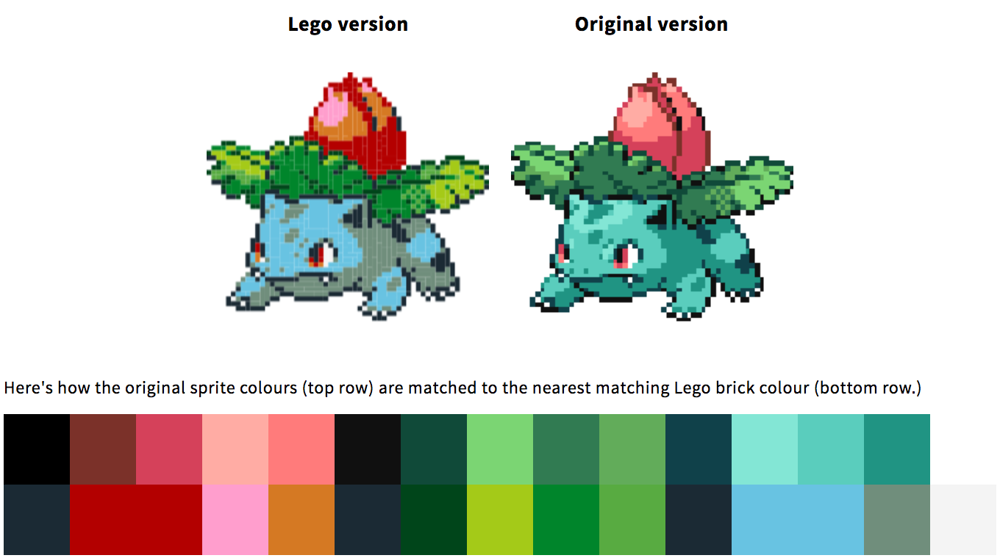
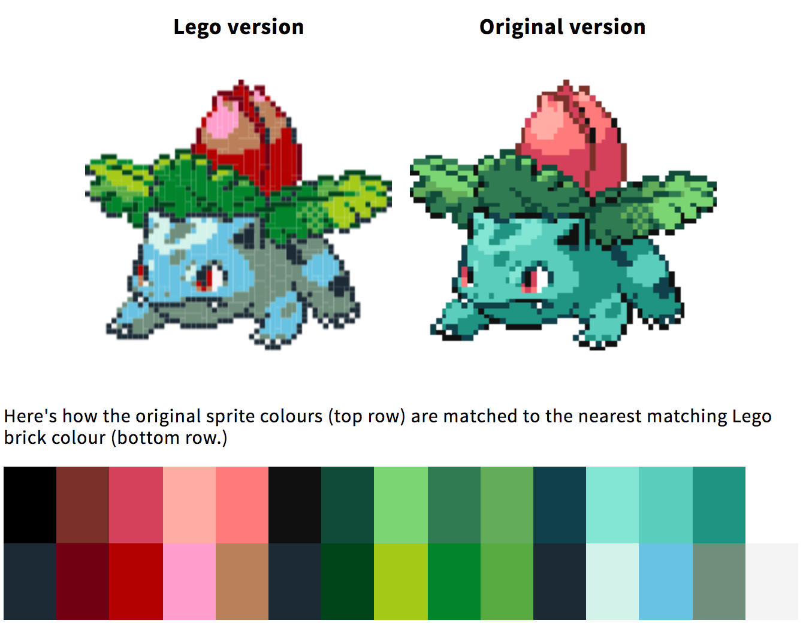

# PokéProject: Adventures with LEGO Bricks

## Part 1: Using JavaScript and HTML5 canvas elements to convert images into 2 dimensional LEGO brick plans.

#### From image sprite to pixel art.

What’s the difference between the image sprites included in the original Game Boy games and Retro Pixel art? If you ask me, it’s just a matter of scale — scale the images up, and suddenly it’s art.

Art, for reference.

But simply printing this ‘pixel art’ out at a large size isn’t really impressive. After all, why bother? — you could just as easily go with a higher resolution version of the same image. You could print a version of the pixel art on something the size of a postage stamp, but just as easily print it on a sheet of paper, or on a large poster — there’s no constraints on standard printing, after all. What’s more visually impressive is mixing media. If you made your pixel art out of lego for example; well, that’s more interesting.

💡 From this idea, PokéProject: LEGO Edition was born.

LEGO bricks come in a variety of colours and with a fairly rigid set of dimensions. The smallest of these is the 1x1 brick, approximately 8mm square in size. If we could recreate a 32x32 pixel sprite that’d give us something just over 25cm square in size, and a 96x96 sprite would be just under 77cm square, which sounds like it could make some impressive pieces for wall art.

So, how to make this a reality?

#### Data sources and harvesting

The first thing I needed to do was discover what LEGO bricks were available, and in what colours. Information for the available colours is readily available from [a variety of sources](https://bricks.stackexchange.com/questions/75/how-many-different-colours-of-lego-bricks-are-there), including RGB and Hex colour mappings, so it was easy enough to grab that data.

To find out what bricks were actually available to purchase (given that a lot of bricks are not available to purchase individually and on demand) I had to visit the [official LEGO Pick-A-Brick service,](https://shop.lego.com/en-GB/Pick-a-Brick) and essentially scrape the entirety of their search results to collate a data store of the available bricks for use in my calculations.

I’ve made [the results of my data harvesting efforts available on GitHub.](https://github.com/psyked/LEGO-Bricks-Data)

#### Palette mapping

The original Game Boy Colour could support over 32,000 colours \[[source](https://en.wikipedia.org/wiki/List_of_video_game_console_palettes#Game_Boy_Color)\], but LEGO Bricks only come in 40 or so \[[source](http://lego.wikia.com/wiki/Colour_Palette)\]. The first challenge was to map those two palettes together and visualise the outcome.

Directly mapping colours to colours wasn’t especially hard to implement — and the effects weren’t too bad either.

For the first pass at this colour mapping, I used what was essentially a [Euclidean distance](https://stackoverflow.com/a/13587077/377961) calculation, treating the colour of each pixel in the source image as a number and finding the nearest match in the more limited lego colours palette.

#### Introducing… perceptual Colour Matching theory

After a little testing, it emerged that the simple colour matches being used weren’t quite up to scratch. As an example, the lightest of colours — which were quite clearly a grey, green or blue — would be matched with the light pink colour, because that’s the closest match from a programmatic point of view, or important details would get lost when there’s not a lot of contrast.

DeltaE colour matching on the left, Euclidean distance in the middle, source sprite on the right.

Fortunately lots of smart people have already figured this out and solved it several times over, and come up with standard formulas for calculating colour matches based on human perception. With the help of [StackOverflow](https://stackoverflow.com/a/29247003/377961) and the [DeltaE library](http://zschuessler.github.io/DeltaE/) I was able to make some great improvements in the colour matching, enabling a much more nuanced palette map.

DeltaE (the 1976 version) colour matching isn’t half bad.

There are actually three versions of the DeltaE / LAB perceptual colour matching calculations, so with a little experimentation I was able to try them out until I found one that seemed to work well across the board.

#### Expanding the data set

It was at this point in time I stumbled across an interesting piece of information — not all of the available LEGO bricks are actually available through Pick-A-Brick, but many of them _are_ available through the [replacement parts service,](https://www.lego.com/en-gb/service/replacementparts/sale) providing you know the part id of the brick itself.

This data set was a little more difficult to put together, but it’s essentially the same principle — scraping the official LEGO website and putting it into a JSON data set for my source code to use.

The effect of this that it massively expands the available brick colours and dimensions, which in turn greatly improves the quality of the colour matching in our models.

LEGO Brick colour matching, using the available bricks from the replacement parts service.

Finally happy with the outcome of mapping sprite pixel colours to LEGO brick colours, I decided to tackle the next challenge — making efficient use of LEGO bricks.

---

You can see the code in action here: [https://www.pokeproject.co.uk/lego/](https://www.pokeproject.co.uk/lego/)

**_Stay tuned for Part 2!_**

[Read Part 2](https://medium.com/@psyked/pok%C3%A9project-adventures-with-lego-bricks-cd9401091239)