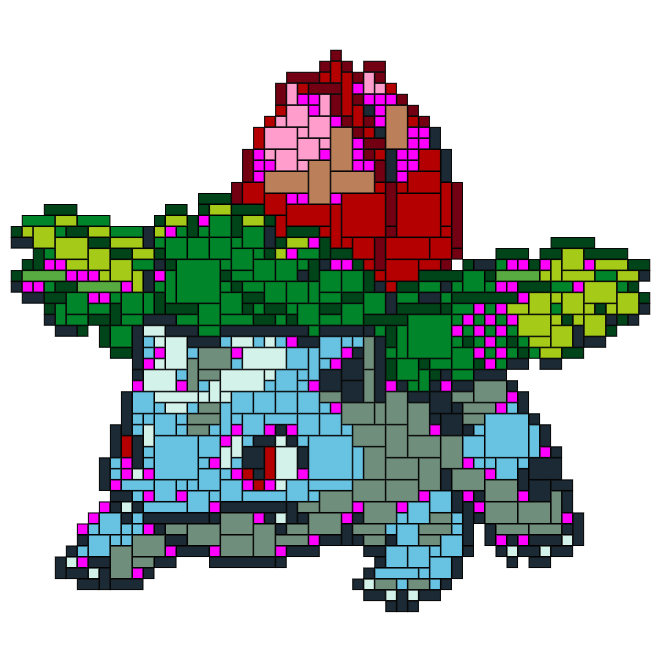
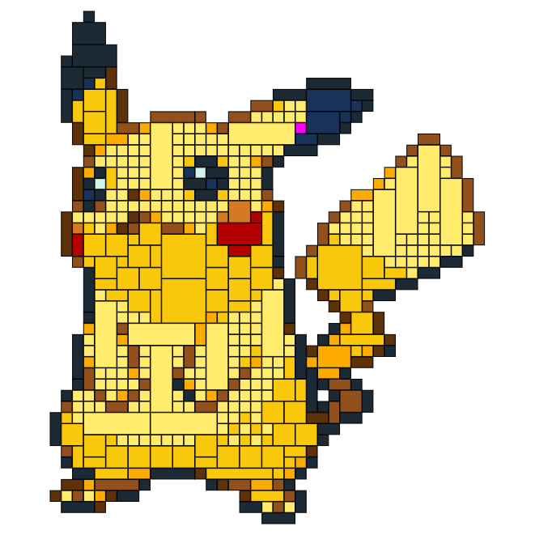
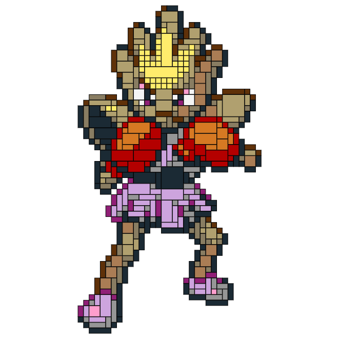
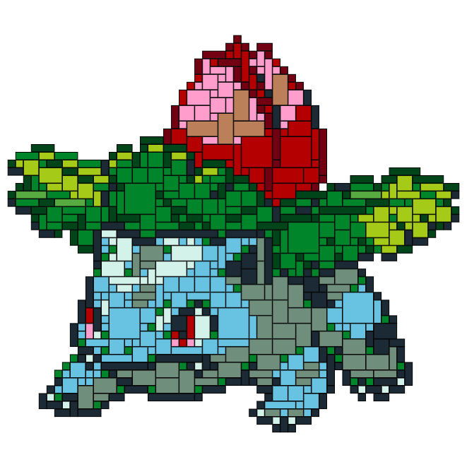

# PokéProject: Adventures with LEGO Bricks

## Part 3: From a theory to the real world.

PokéProject: LEGO Edition [started with colour mapping](https://medium.com/@psyked/pok%C3%A9project-adventures-with-lego-bricks-7f24c02f6d9d) and developed into a calculation of [optimal brick placement](https://medium.com/@psyked/pok%C3%A9project-adventures-with-lego-bricks-cd9401091239), and now I’m planning to put some money on the line and _actually purchase_ some bricks and make this project into a tangible reality.

---

#### Realistic Brick calculations

So what’s next? Turns out there’s one more issue… a flaw in my logic.

I had incorrectly assumed that all of the LEGO brick colours I’d grabbed from the internet were available as 1x1 bricks, and my ‘algorithm’ was based around that assumption. When I actually went to go and purchase those bricks… then I had a problem. And for some sprites, it was quite a problem.

I’ve highlighted the problematic pixels in these images:

Highlighting the invalid / unavailable pixels in Magenta

So, how best to deal with this issue?

I’m loathe to simply remove those pixel colours from the pool — I like what I’ve achieved with the colour matching, and besides we only have 41 LEGO colours to play with as it is — don’t want to reduce that pool any further.

My solution was to take those invalid bricks and find the next best fitting brick colour, repeatedly updating and looping through the image data and recalculating a next-best colour match for each pixel of the sprite until I had an acceptable match.

The same sprites with next-best colour matching for invalid pixels

Naturally, I went through quite a bit of trial and error to get to this stage — I tried selecting average pixel colours from neighbours, but that generally lost details, and I tried some complicated contrast-based comparisons to bleed similar colours into neighbouring invalid pixels, but that didn’t work well either. The simplest solution was the best — calculating a prioritised list of matching colours for each brick, and regressing through that list whenever the bricks we wanted didn’t actually exist.

---

#### Making the jump from theoretical to physical

_Finally,_ I have a working sprite-to-lego-brick conversion tool at my disposal. It calculates nearest matching bricks, does some optimisation, and spits out a sensible shopping list of items to purchase.

Placing my order with the online LEGO store was (unfortunately) a fairly laborious process, because there doesn’t seem to be a nice bulk ordering system, but after about half an hour of manual entry I managed to get every individual brick in the basket. £37.69 paid to the LEGO store online and in the next 7–10 working days, the raw materials for my new creation should be with me.

My LEGO Pokemon sprite tool is online, if you’d like to create a pattern and see the list of Bricks for it yourself: [https://www.pokeproject.co.uk/lego/](https://www.pokeproject.co.uk/lego/)

---

#### Beyond Pokémon 🔮

The exciting opportunity for this project now is that I have the start of a fairly generic image-to-LEGO pattern generator, which I might evolve into a proper standalone project over the next few months. After all, wouldn’t it be fun to turn more Retro games artwork into LEGO patterns? or webcam images, or profile photos or works of art? So many possibilities!

---

**_Expect Part 4 within 7–10 working days._**