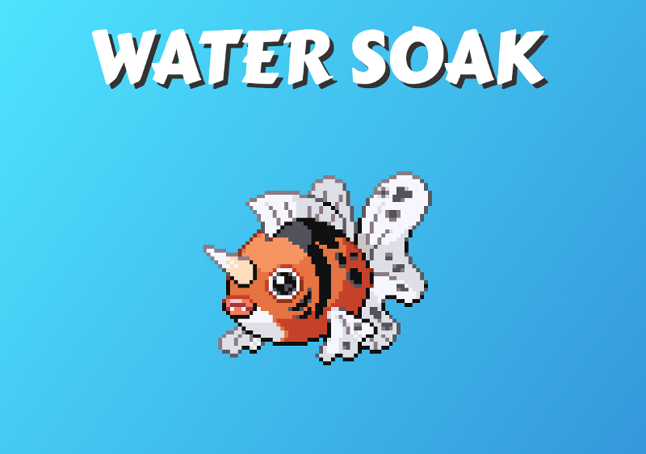

# PokéProject Dev Diary: Day Five

## Move fast, change things.

Cover image by Alice Achterhof / Unsplash: [https://unsplash.com/search/painting?photo=FwF_fKj5tBo](https://unsplash.com/search/painting?photo=FwF_fKj5tBo)

[PokéProject](https://www.pokeproject.co.uk/) has been live for just over a day now, and I’ve had some initial feedback from early users.

Amongst that feedback was updating the design to include gradients, much like those provided by the [Granim library.](https://sarcadass.github.io/granim.js/) Other bits of feedback have been that it’s frustrating, not being able to download or share the generated images, and that the sprites don’t quite scale properly on browsers other than Chrome.

Armed with this feedback I’ve completely recreated the visuals using the HTML5 Canvas element instead of simple DOM elements; gone are the **
**, **** and CSS elements to be replaced by a**<canvas />** element, featuring gradients, sprites and web fonts.

Using a canvas element has several advantages — the resulting images can be easily saved, the gradients are always smooth, and the scaling of the sprites can be tightly controlled, avoiding any unwanted blurring.

Such a significant change takes a little while, so that’s about all I’ve managed for today’s development session.

One final thing for the day is that I’ve now set up a proper backlog on [Trello](https://trello.com/) to keep track of my future development ideas and feedback from users.

#### Retrospective

What’s next? Rewriting everything in canvas was a bit of a big step for the second day that the website had been live, so perhaps we’ll not be doing that again in a hurry.

The next big thing is really to get some traction in Google rankings and drive some traffic towards PokéProject, and for that we need to start considering things like SEO. Next up then, is some SEO work.

---

PokéProject is available online @ [https://www.pokeproject.co.uk](https://www.pokeproject.co.uk)