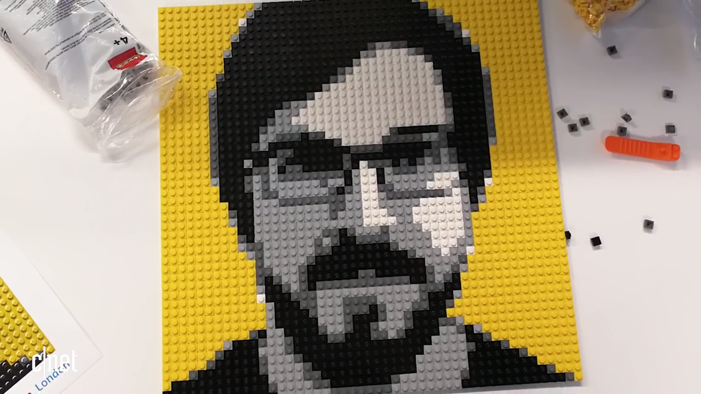

# PokéProject: Adventures with LEGO Bricks

## Part 2: Making optimal use of the available bricks.

By this point I’ve already mapped my colour palette of my source image to the available LEGO brick colours as described in [my previous post,](https://medium.com/@psyked/pok%C3%A9project-adventures-with-lego-bricks-7f24c02f6d9d) and now I want to move beyond simple colour trickery and onto making this idea a physical reality.

#### Optimal Brick calculations 💰

Looking into the feasibility of actually purchasing LEGO bricks to make these sprites, it turns out it’s quite expensive. The bricks themselves average around £0.05 each, which puts the cost for a 64x64 pixel image at £204.80, which is _extreme._

However, there’s economies to be made. If you can use fewer larger bricks to produce the same image, the effective cost-per-pixel can drop significantly, to around £0.01 per pixel, which saves quite a significant amount of cash.

Needless to say, I put a fair amount of effort into optimising expenditure.

#### It’s just not LEGO

In addition to the raw cost issue, it doesn’t really _feel_ like a real project if everything is made of 1x1 bricks. That’s the kind of boring thing that an old style dot-matrix printer would output, and it doesn’t feel all that creative.

As it transpires, this is exactly what [a dedicated booth in the London LEGO shop](http://nerdist.com/londons-lego-store-lets-you-buy-a-lego-mosaic-of-your-face/) does, but I still think it’s a cop-out and I can do better.

Who really wants to place 2,304 individual LEGO bricks, anyway?

---

#### In search of prior work.

I am a lazy programmer. I would much prefer to reuse someone else’s code than spend ages trying to figure it out myself, and to this end I Googled an endless variety of phrases looking for some kind of prior work around the optimal use of LEGO bricks in a two-dimensional plane, only to come up with absolutely nothing.

I _did_ read some fascinating articles about such things as [“An approximation algorithm for finding the largest rectangle inside a non-convex polygon”](https://d3plus.org/blog/behind-the-scenes/2014/07/08/largest-rect/) and a helluva lot of posts about everything from [Bin Packing](https://en.wikipedia.org/wiki/Packing_problems) to [JPEG compression](https://en.wikipedia.org/wiki/JPEG) on StackOverflow and Wikipedia, but ultimately there’s nothing that I could find which was appropriate.

> It would appear that the optimal placement of an unlimited combination of arbitrarily-sized shapes within randomly shaped containers is not a high enough priority for the Computer Science community to have already solved effectively, much to my dismay.

I was going to have to actually write the logic myself. 🤔

---

#### Writing it myself.

Changing the colours of an image with JavaScript and HTML5 canvas elements is fairly easy — you pull in the image data as an Array, and you loop through it to get the R,G,B,A values for each pixel, which you can modify on the fly. Simple enough, but it lacks understanding of pixel coordinates and any sense of neighbouring pixels.

My solution was to copy the image data into a new data structure which could easily reference its neighbours, and then for each pixel iterate through the available LEGO bricks — first to find the nearest colour match, and then to find the largest possible brick which could fit anchored at that point.

Given a few passes the outcome is quite acceptable.

1x1 Bricks versus fairly-optimal various-sized Bricks

It’s not the most optimal solution that might be technically possible, but it’s better than doing nothing at all to optimise the output.

The biggest flaw is that it effectively scans through the image, top to bottom, left to right, to try and place bricks in an optimal fashion. Logically there could be better starting points for some shapes, ones which ultimately use less bricks to complete, but such an approach requires an infeasible number of passes to optimise, and that isn’t something I even want to try.

So what’s next? Turns out there’s one more issue… a flaw in my logic.

---

You can see the code in action here: [https://www.pokeproject.co.uk/lego/](https://www.pokeproject.co.uk/lego/)

**_Stay tuned for Part 3!_**

[Read Part 3 now!](https://medium.com/@psyked/pok%C3%A9project-adventures-with-lego-bricks-c7b9b8385276?source=linkShare-61a2d6b6c632-1497419972)