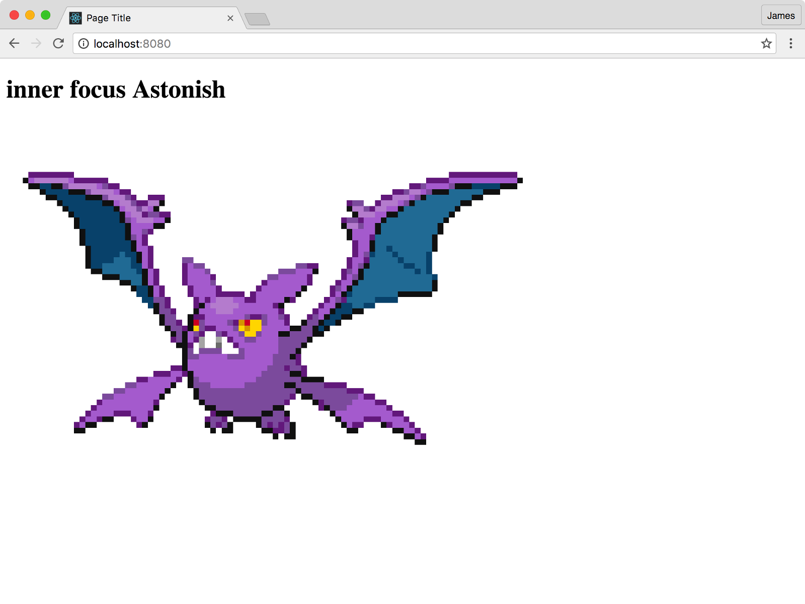

# PokéProject Dev Diary: Day One

## Let’s get this show on the road.

We have [our inspiration](https://medium.com/@psyked/pok%C3%A9project-dev-diary-prologue-d214a44c348f#.fra9ia259), so now it’s time to throw a prototype together. I’m pacing the development of this project out in blocks of a few hours at a time, and usually in an evening.

Fortunately I’ve done quite a few different projects before, and have got a starting point in my [new project template](https://github.com/psyked/starter-project-template), which includes tech like SASS, Babel and Grunt, in the way that I like to use ‘em.

With the basic HTML, CSS and JS setup done, we’re gonna need some data to work with. A little bit of Googling will quickly return a [JSON file of Pokemon](https://gist.github.com/shri/9754992) from GitHub, which is a perfect starting point, as it includes all of the Pokemon details — names, moves, and a whole load of other things we don’t quite need right now. It’s the names, types and moves which are of interest at the moment, because that’s where we’ll draw the Project Names from — a little bit of code to smash those things together and we’re on a roll. For the first bit of project naming logic, we’re going to go with:

> Select Random Pokemon  
> Project Name = Random Pokemon Type + Random Pokemon Move

Once we’ve written our code to load the JSON data and the names are mashed together, that’s essentially our first prototype complete.

It’s lacking a lot on the visuals though, so I also went hunting and found an archive of Pokemon sprites from the original games — added to the project and combined with the existing code, we can spice up the visuals and that’s not a bad few hours’ work, I think.

Version 1 of PokéProject, in all its glory.

Okay, we’re not going to be winning any awards with this just yet, but the output from the completely random names actually isn’t all that bad.

#### Retrospective

So far, so good. The next big thing has got to be the visuals though — and online [examples such as this one on CodePen](http://codepen.io/mikun/pen/YWgqEX) really set the bar visually, so that’s where we’ll take things next, I think.

**Edit:** PokéProject is now online @ [https://www.pokeproject.co.uk/](https://www.pokeproject.co.uk/)