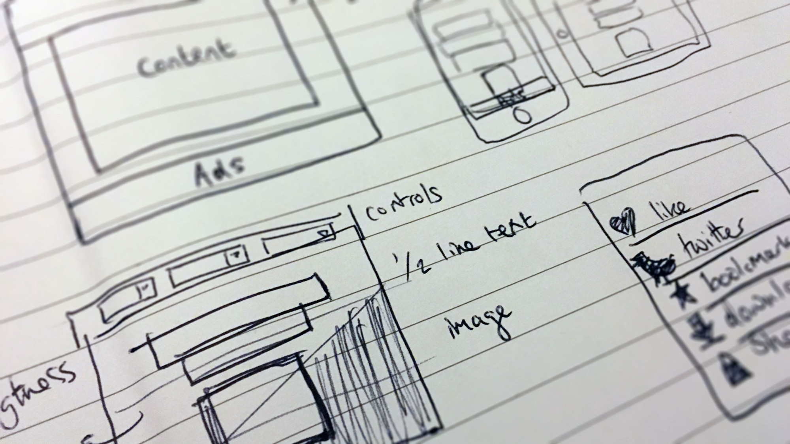
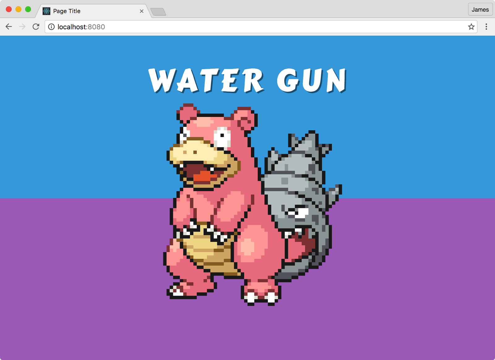
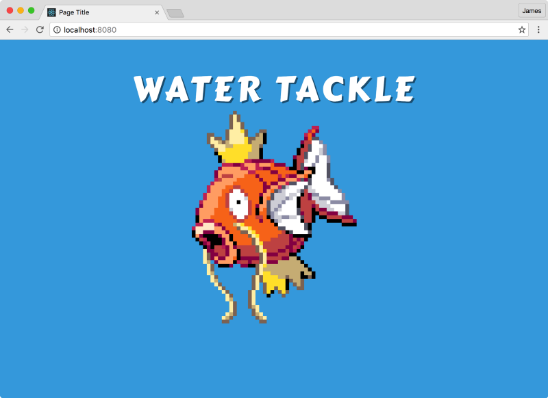
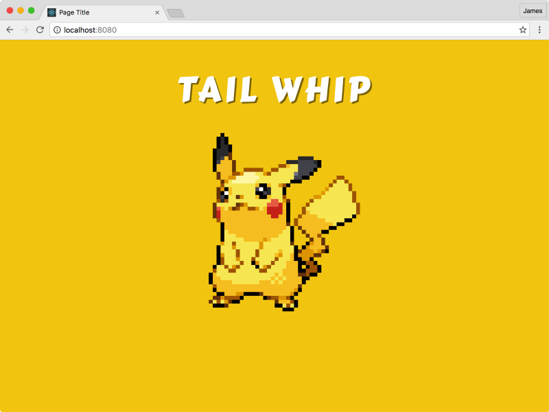

# PokéProject Dev Diary: Day Two

## Where we refine the design.

A few days have passed since we started development \[see days [0](https://medium.com/@psyked/pok%C3%A9project-dev-diary-prologue-d214a44c348f#.su79ueao5), [1](https://medium.com/@psyked/pok%C3%A9project-dev-diary-day-one-8a77a252bf0a#.2c15a2on6)\], so there’s been a little time to sit down, review the prototype and refine our product vision.

If you draw things on paper it totally looks like proper rapid prototyping.

What’s going to be our unique selling point — the thing to distinguish us from every other code name generator out there — is the visuals, so we’re going to prioritise them and tackle them first.

I like to check out websites like [Dribbble](https://dribbble.com/search?q=pokemon) and [CodePen](http://codepen.io/search/pens?q=pokemon&limit=all&type=type-pens) for ideas, and having done that I think big, bright themed colour blocks are the way to go. Combined with a bit of colour sourcing from [Kuler](https://color.adobe.com/explore/newest/) and pulling in a font that’s a near match to the official Pokemon logo (well, as much as any of the fonts can be), the prototype now looks like this:

How Slowbro appears: Water / Psychic Pokémon

And Magicarp, Pikachu and Tangela

#### Bonus Round: Going Online

For extra bonus points, we’ve even gone to the extent of dropping this onto a subdomain on my main website — [http://pokeproject.psyked.co.uk/](http://pokeproject.psyked.co.uk/) — so that we can start getting some basic feedback from the guys and gals at the office.

#### Retrospective

We’ve got something barebones complete and online really quickly, which I’m pleased to succeed at, but we’re really lacking on the usability side of things — refreshing the screen for a new result each time sucks, as does the lack of permalinks or any other way to share what you see.

I do like the visuals so far, but I don’t think they’re punchy or inimitable enough to be considered ‘final’, so there’s more work to be done there.

#### Next Steps

One thing that’s bugging me is actually [the JSON data that I pulled off GitHub](https://gist.github.com/shri/9754992) — it’s not complete or contiguous when you look at it in detail — and the missing bits of data are causing the occasional Javascript error and breaking my code. My plan for the next session is to find — or create — my own, more optimised, more reliable data set to work with. But before that, we’ll do some testing and get user feedback from my as-yet-unsuspecting work colleagues.

**Edit:** PokéProject is now online @ [https://www.pokeproject.co.uk/](https://www.pokeproject.co.uk/)