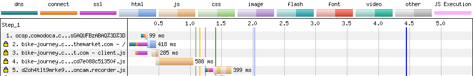
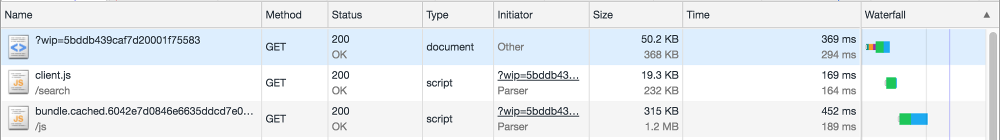
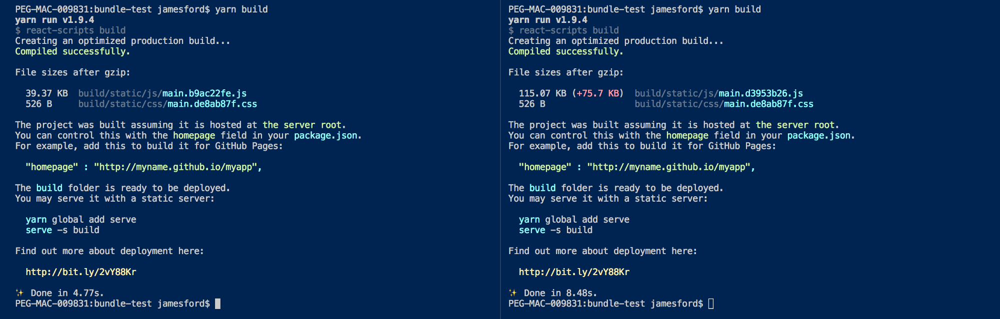
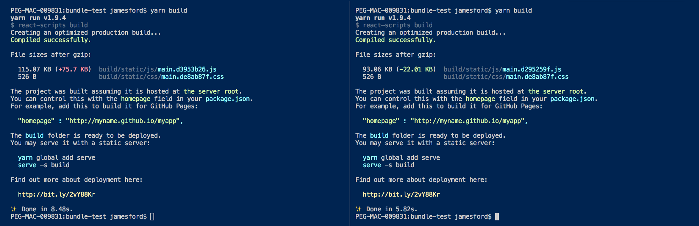
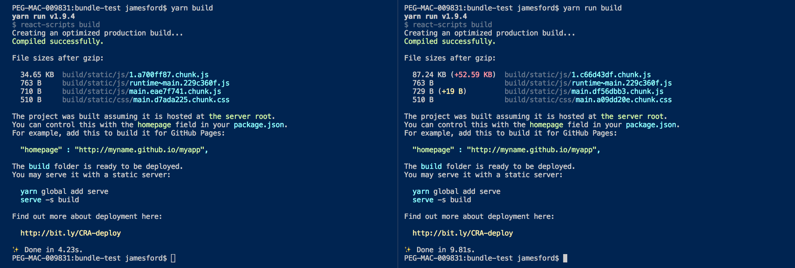

# Putting our Component library on a diet.

## Performance matters, and “Houston, we have a problem.”

Photo by [Bernard Hermant](https://unsplash.com/photos/bSpqe48INMg?utm_source=unsplash&utm_medium=referral&utm_content=creditCopyText) on [Unsplash](https://unsplash.com/search/photos/balloon?utm_source=unsplash&utm_medium=referral&utm_content=creditCopyText)

A shared set of components is a great idea, so long as using those components doesn’t bloat your client applications. This is a brief tale of how we got it wrong, what the cause of our issues was, and how we fixed it.

---

#### Introduction

At c[omparethemarket.com](http://tech.comparethemarket.com) we produce an internal library of React Components which are used across different portions of our website, which is part of a strategy that we refer to as ‘inner sourcing.’ It’s a great idea for getting consistency across our sites, but we soon realised that we had a bit of a problem with performance, page weight and download times.

A (cropped) screenshot of the network chart from WebPageTest.org

A (cropped) screenshot from the Chrome DevTools

The screenshots (above) shows some stats from one of our pages, which was using an early version of our component library. From this we could see that the Javascript file needed to load our page was around 300 KB in size, and uncompressed on the customer’s browser to a meaty 1.2 MB of raw code. 😱

The indicative performance impact of this single file — as shown in the WebPageTest.org snapshot above — is approximately half a second. That’s half a second of the browser doing literally nothing other than downloading, parsing and executing this file, during which it displays a nothing to the user.

> Generally speaking, the majority of website performance issues are Front-End problems, and not hardware or network issues.

[**the Performance Golden Rule**  
_Yesterday I did a workshop at Google Ventures for some of their portfolio companies. I didn’t know how much performance…_www.stevesouders.com](https://www.stevesouders.com/blog/2012/02/10/the-performance-golden-rule/ "https://www.stevesouders.com/blog/2012/02/10/the-performance-golden-rule/")

This single file is actually a React application which renders the whole page. It is render-blocking, meaning that it must be downloaded and parsed by the browser before anything on the page can display, and thus this one single file is one big problem for performance.

### Page Size Matters

Everything about Page Speed and Performance is all intermingled, but Javascript file size is a good indicator of how long the file will take to download, be parsed by the browser, and then execute.

There’s a certain amount of file size we can’t avoid with our Javascript. We need libraries like React for the experience we’re developing, and a shared library of components is a sensible idea, but something somewhere has gone horribly wrong if our output bundle size is so huge. — In some cases, we were seeing reports of**+500Kb** file size being introduced on the addition of a single button, so something wasn’t correct.

### Experiment Driven Development

To take a closer look at what’s going on, we created a simple React application, looked at the application size, added a single (styled Button) component, and looked at the application size again.

The [create-react-app](https://facebook.github.io/create-react-app/) tool outputs some pretty decent metrics as part of its default build process, so this became our quick-and-easy, side-effect free environment for testing the impact our library has on build sizes. (There could quite conceivably be issues elsewhere in the code of those making these reports, so it’s important to have a reliable benchmark.)

On the left: The out-of-the-box app. On the right: With a single component added.

It’s not quite +500 KB gzipped, but 75 KB is still an excessive amount of code for a single styled Button. Looking at the output bundles, it soon became clear that what was happening is that when we include any component, we’re also getting the source code of a dozen other components whose source code is also included in our library, but isn’t actually being used by our sample application. Not good.

Photo by [Markus Spiske](https://unsplash.com/photos/466ENaLuhLY?utm_source=unsplash&utm_medium=referral&utm_content=creditCopyText) on [Unsplash](https://unsplash.com/search/photos/dead-code?utm_source=unsplash&utm_medium=referral&utm_content=creditCopyText)

#### Tree Shaking / Dead code elimination

All of this additional code for unused components is increasing our bundle size, but I had expected Webpack — with its native support for [dead code elimination](https://webpack.js.org/guides/tree-shaking/) — to automagically remove that unused library code and deliver a more optimised bundle.

[**Reduce JavaScript Payloads with Tree Shaking | Web Fundamentals | Google Developers**  
_Knowing where to begin optimizing your application's JavaScript can be daunting. If you're taking advantage of modern…_developers.google.com](https://developers.google.com/web/fundamentals/performance/optimizing-javascript/tree-shaking/ "https://developers.google.com/web/fundamentals/performance/optimizing-javascript/tree-shaking/")

So, why didn’t it?

The answer to this question is complex and fairly specific to our project, but it involves our Babel configuration, our CommonJS output format and our use of CSS modules. All of these elements combine to create library bundles which fundamentally cannot be tree-shaken by Webpack.

So, how to we build a tree-shakable library bundle?

### A better bundler… with rollup.js

After a lot of experimenting with different options and configurations for Webpack, we eventually realised that it was ‘the wrong tool for the job’ when it came to building our bundle of library components. As a replacement we picked [rollup.js](https://rollupjs.org/guide/en), which amongst other perks is better at producing library bundles that supports dead code elimination.

[**rollup.js**  
_Rollup is a module bundler for JavaScript which compiles small pieces of code into something larger and more complex…_rollupjs.org](https://rollupjs.org/guide/en "https://rollupjs.org/guide/en")

Our consumer applications still use Webpack to package our final React applications, but using rollup.js for our library bundles now means that when Webpack compiles its output, it’s able to tree shake our library code and eliminate the components that aren’t used.

And the final results?

On our example project, switching to Rollup-bundled libraries immediately saves an extra 22 KB out of 75 KB (almost 30%) with literally no changes to the example application itself.

On the left: Create-react-app using our library packaged with Webpack, on the right: using the library packaged with rollup.

Even more exciting is the effect when we applied this same updated library to a real-world example, which yielded optimisations closer to 60% of the total file size:

    File sizes after gzip:  287.02 KB (-430.7 KB)  build/static/js/main.5978ff57.js

**430.7 KB** saved from our output bundle, thanks to using a tree-shakable React Component library, bundled with properly-configured Rollup instead of our out-of-the-box Webpack configuration.

### Summary

Our React Component library was part of a natural evolution from several projects, but we took our eye off the performance impact of the code that we were building and it quickly snowballed into something that had detrimental effect on the projects that included it.

The root cause of this problem was our bundling strategy, and the fact that it couldn’t determine which code was necessary to render the components, so it always included everything.

The solution was to shift our bundling strategy into Rollup and also to change our Babel configuration to one that better supported dead-code elimination.

Webpack isn’t a bad tool, but it has to be configured properly and used for the correct tasks, and because of the gradual nature of our project evolution, our setup wasn’t suitable. Pausing, evaluating, and spending some time focussing on our build processes has allowed us to make these gains.

### Key Takeaways

*   Javascript syntax patterns, such as CommonJS, have different side effects when it comes to dead-code elimination in your code bundler.
*   Webpack is good for bundling projects, but Rollup is better for libraries.
*   You’re still going to need Babel, regardless of whether you’re working with Webpack or Rollup. It’s the Babel configuration which has the biggest effect on the outcome.
*   Test, test and test again, and do it in an environment that is representative of your anticipated customers’ workspace.

---

### Bonus: Create-React-App 2 & Webpack 4

Since originally penning this article, we’ve had clients update to using [create-react-app](https://github.com/facebook/create-react-app) version 2 and Webpack 4, which delivers even more benefits to our bundle size and performance, with no additional code changes.

Repeating the tests with version 2 yields these results in our example application:

On the left: Create-react-app 2, on the right: with our library added

And here’s a real world example of the bundle size output on **create-react-app** version 1.1.4:

    File sizes after gzip:

      188.49 KB  build/static/js/main.53169928.js  112.37 KB  build/static/js/BasicQuestions.9168ec4c.chunk.js  110.43 KB  build/static/js/ComplexQuestions.5706b399.chunk.js  110.4 KB   build/static/js/SubQuestions.194d1d33.chunk.js  110.3 KB   build/static/js/CustomQuestions.736521d5.chunk.js

    File sizes after gzip:

      255.75 KB  build/static/js/main.b68bc851.js  846 B      build/static/css/main.a86b8cd7.css

And the same real-world project again, this time using **create-react-app** version 2:

    File sizes after gzip:

      112.58 KB              build/static/js/7.58c36855.chunk.js  66.56 KB               build/static/js/0.72b13458.chunk.js  65.62 KB (-122.87 KB)  build/static/js/main.20b9faa3.chunk.js  40.56 KB               build/static/js/1.ac53a9a6.chunk.js  3.32 KB (-109.06 KB)   build/static/js/BasicQuestions.6df1fce5.chunk.js  1.47 KB (-108.96 KB)   build/static/js/ComplexQuestions.61562335.chunk.js  1.44 KB (-108.97 KB)   build/static/js/SubQuestions.d5066422.chunk.js  1.24 KB (-109.06 KB)   build/static/js/CustomQuestions.b2e5a8af.chunk.js  1.24 KB                build/static/js/runtime~main.6da60b22.js

    File sizes after gzip:

      156.02 KB              build/static/js/1.c932bec8.chunk.js  89.89 KB (-165.86 KB)  build/static/js/main.2f744215.chunk.js  837 B (-9 B)           build/static/css/main.8ee9f0fa.chunk.css  763 B                  build/static/js/runtime~main.229c360f.js

A ‘simple’ upgrade that implements cleverer bundle splitting for shared code libraries, and we’ve automatically saved even more 100’s of KB across the site, which is pretty neat. 👍