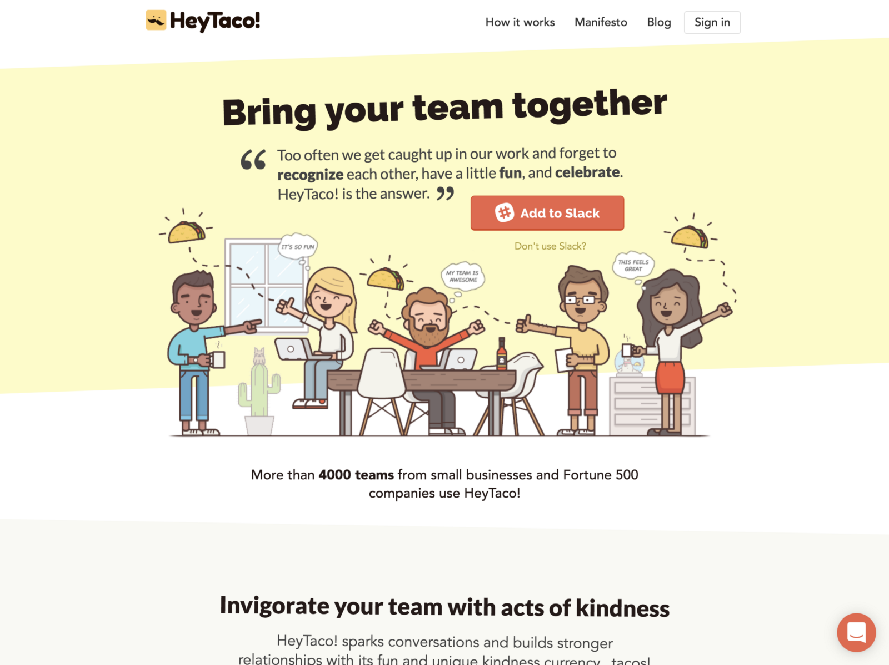

Being recognised and rewarded for your efforts in the workplace is important, as is taking the time to recognise and reward others. Taking the time to deliver a direct, verbal expression of gratitude can mean a lot to its recipient, but adding a tangible reward makes it even better.

Common sense says gratitude and appreciation for their efforts makes people feel happier. Science says happier people are more resilient, more motivated and more productive. Being included in a happy environment makes people happy.

Photo by [rawpixel](https://unsplash.com/photos/fbgFbOTOWz4?utm_source=unsplash&utm_medium=referral&utm_content=creditCopyText) on [Unsplash](https://unsplash.com/search/photos/happyness?utm_source=unsplash&utm_medium=referral&utm_content=creditCopyText)

Taking time to express gratitude to others is a mindset that doesn’t seem very common, that is to say it’s not a habit that many people naturally have. Perhaps it’s a cultural thing, but as gratitude is a cornerstone of happiness, it makes sense for a business to encourage a culture of gratitude and peer recognition in the workplace.

[Laura Trice: Remember to say thank you](https://www.ted.com/talks/laura_trice_suggests_we_all_say_thank_you)

[Want to be more happy? Be more grateful](https://www.ted.com/talks/david_steindl_rast_want_to_be_happy_be_grateful)

### Real world examples

I’ve worked at a few companies which support this idea of giving thanks, and here is a bit of information on the systems they have in place, followed by a little analysis of them.

---

#### Magic Moments

At [MMT Digital,](https://www.mmtdigital.co.uk/) we had ‘Magic Moments’ – a scheme where anyone could nominate anyone else for a reward. Nominations are made by means of a message to HR or line managers, and had three tiers (small, medium and large.) When you made the nomination you would detail what exactly had been done to earn a ‘Magic Moment’, and you could indicate what you’d like to give the recipient as a reward.

The process was manually operated, with a little oversight and approval from line managers. The awarding process was fairly low-key and private, being between yourself, the recipient and your respective line managers.

---

#### HeyTaco!

At [Deeson,](https://www.deeson.co.uk/) we used an app called [HeyTaco!](https://www.heytaco.chat/) to express gratitude, with a reward up for grabs each week for the top Taco recipients.

[**HeyTaco!**  
_Boost engagement with our fun and unique team building tool for recognition, appreciation, and rewards._www.heytaco.chat](https://www.heytaco.chat "https://www.heytaco.chat")

HeyTaco! is a Slack integration, and each day everyone in the company had a budget of five Tacos (🌮) which they could elect to award to someone else in the company.

There was no rigid criteria for awarding Tacos, it could be anything from having a birthday to smashing out some awesome work. Everyone had the same amount of Tacos, and all awarding of Tacos was public. You could award single or multiple tacos to individuals throughout the day or award them to multiple people at once.

At the end of the week a leaderboard of Taco recipients would collated and on a Monday morning the Top 5 from the leaderboard would be selected, a die would be rolled (recorded on video for the remote staff) and on a result of 1 or 6 those people would win money from the pool. On anything else, the value of the unused pool would be rolled over to next weeks die roll. You could win up to £50 each, and if the pool was larger the remaining value went to a local charity.

> Competition was fierce, but I managed to get lucky and be in the Top Five one week and win with a lucky roll of the die. I spent my portion of the award money on some frivolous socks to wear at the office, because why not?

---

#### Instants

At [CompareTheMarket](https://www.bglgroup.co.uk/comparethemarket/benefits) we have ‘Instants’, which is a bespoke system for rewarding colleagues. Through the intranet we can visit the Instants page, select an employee, enter a reason for awarding them an Instant, select a company value which they’ve demonstrated and then pick a gift from the available pool. The reward is then emailed to the recipient and your respective line managers. No waiting, no approval needed, hence the name.

The rewards vary depending on availability and the office they’re located in, but can be anything from a free drink, chocolate or a shopping voucher to a half day holiday. The company has a generous but shared pool of rewards available for a specific time period, so to an extent you have to be lucky enough to get the reward you might want, but there’s always something available.

> Taking a bit of inspiration from HeyTaco!, the team has recently built in a Slack integration for Instants, which lists the top receivers for the previous week, and I’m sure there’s more functionality they’re working on as we speak.

---

### Analysis

Each of these systems is different, and arguably each flawed or open to exploitation, but any recognition systems can be exploited or manipulated if that’s your intention. Here’s some of the major pros and cons – without meaning to criticise too harshly. For all of these, my default position is that any system is better than no system at all.

#### Magic Moments

**Pros:** allows you to give personalised, graded rewards to anyone, and it’s a conscious coordinated affair to arrange a reward.

**Cons:** What I really felt was lacking from Magic Moments was the low-key nature of the rewards. Often they were a private thing, and while genuinely open to everyone, they weren’t promoted as much as they could have been – had these rewards been more publicly announced, it might have encouraged wider participation in the scheme.

---

#### HeyTaco!

**Pros:** as a Slack plugin it ties in very well with remote teams, and giving everyone a budget of 5 Tacos a day encourages very active, public and frequent positive feedback loop.

[HeyTaco!](https://www.heytaco.chat/)

**Cons:** Our usage of HeyTaco! felt very much like a popularity contest. The interface was very slick and the app was good, but ultimately it felt that those that repeatedly won the weekly competition were those that worked across multiple teams – designers, managers, Agile coaches – and not people working away on a single team.

The inevitable end result being that it’s a numbers game, which drowned out the achievements and recognition of everyone when it comes to the weekly competition. The dice roll element added some fun, but after multiple consecutive weeks being pipped to the leaderboard by the same people, it didn’t quite feel very inclusive.

---

#### Instants

**Pros:** Instants is an automated system for issuing rewards. What I particularly like is that it feels more direct – there’s no need to coordinate with line managers or others to arrange a reward, and it arrives and can be claimed immediately.

**Cons:** If there’s any criticisms to be levied, it’s that the rewards come from a shared pool across the company. Thus, if you want to give someone a certain reward and there’s none left in the pool you either have to give them an alternative reward or wait until the pool is refilled!

---

### Conclusion

Expressing your appreciation for colleagues does wonders for your working relationship and builds a tighter bond. Similarly a harmonious, appreciative working environment does wonders for productivity and employee retention. With these benefits it makes sense for the company to invest in a mechanism to promote a better, more thankful, working culture.

It’s better to have a system – even if it is flawed or imperfect – as part of a commitment to improving your company culture, than it is to have none at all.

Personally I like the visibility and interaction that HeyTaco! provides, but ultimately I prefer the ease and immediacy of the Instants system. Feedback should be direct and easy to give, and that’s what a successful system will do.