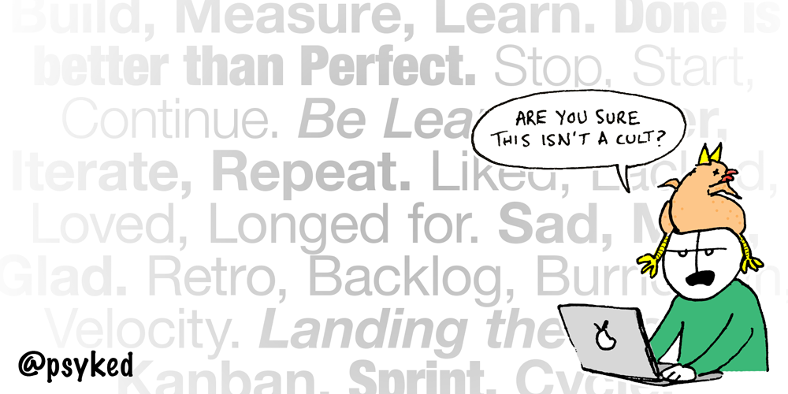

# Rituals, dogma and the Agile Manifesto.

I can’t quite work out if Agile is a buzzword, a cult or some larger form of organised religion. I’m lost in a sea of ritualistic meetings and awash with stuff like #shipit and “Get Shit Done”.

Build, Measure, Learn. Done is better than Perfect. Stop, Start, Continue. Be Lean. Deliver, Iterate, Repeat. Liked, Lacked, Loved, Longed for. Sad, Mad, Glad, Puzzled. Retro, Backlog, Burndown, Velocity. _Landing the Plane._

Are we even doing the right thing? Do we know what we’re doing and – more importantly – why we’re doing it? I’m so confused.

---

Reposted from [https://www.psyked.co.uk/rituals-dogma-and-the-agile-manifesto/](https://www.psyked.co.uk/rituals-dogma-and-the-agile-manifesto/)