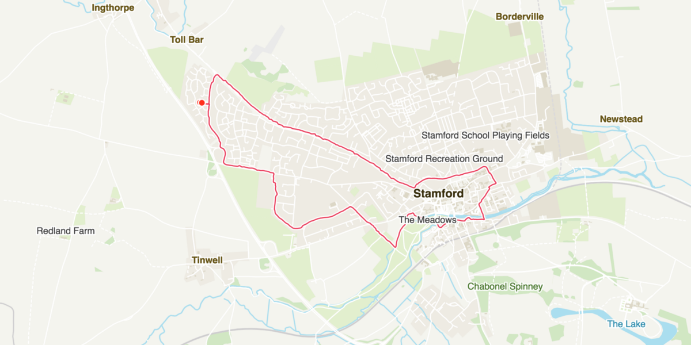

# RunMaps 3: Colour Schemes and Labels

In my previous posts I’ve discussed [the initial development of my RunMaps side-project](https://medium.com/@psyked/generating-run-maps-with-node-js-52738014d3dc) and the subsequent [switch over to using Overpass API](https://medium.com/@psyked/runmaps-v2-0-breaking-free-of-mapbox-dbe3c3ca1a01) instead of the initial Mapbox APIs. Now it’s time to pick up where we left the original development; improving the visuals by adding place labels and map markers.

#### Colour scheming

Coming up with colour schemes for maps is hard. Fortunately there’s existing map providers like Ordinance Survey which have made their colour schemes easy to access (I grabbed some from [this article](https://www.ordnancesurvey.co.uk/blog/2017/12/effective-basemaps/)) and with some effort devoted to mapping those colour schemes to the rendered SVGs I can transform the output so that it looks a little more familiar:

(left) Inspired by the OS ‘Outdoor’ styles, (right) Inspired by the OS ‘Night Mode’ styles

(left) Inspired by the OS ‘Road’ styles, (right) Inspired by the OS ‘Light’ styles

#### Adding labels

Those maps are looking pretty neat now, but they’re still missing labels that give the locations more context. The data is all available, all part of the OpenStreetMap responses, but most of the time that information is attached as a _Point_ object in the GeoJSON — rather than a _Path_ or a _Line _— so they don’t appear visually.

Although the chaining syntax of D3.js still feels a little unnatural, I’ve now learnt that it’s the easiest path to rendering objects with geolocation data. All I have to do is create a new element in the SVG and then apply a transform based on the projection, using some code like this:

const projection = d3.geoMercator();  
const path = d3.geoPath().projection(projection);

svg  
  .selectAll(".label")  
  .data(thingsWithNames)  
  .enter()  
  .append("text")  
  .attr("transform", function (_d_) {  
    return "translate(" + path.centroid(d) + ")";  
  })  
  .style("text-anchor", "middle")  
  .text(function (_d_) {  
    return d.properties.name;  
  })

And I immediately get an output like this:

That’s a lot of labels.

Okay, that’s a lot of labels. Obviously there’s some prioritisation and filtering of labels to be done. I’ll cut it back to ‘places’ — items marked specifically as hamlets, villages, towns and cities — and get a far more readable version of the map that looks like this:

A much better balance of detail.

Reintroducing the route to this map gives the following output, which is much closer to the end result I was looking for:

All of this is achieved with the fairly simple steps of parsing GeoJSON data objects, having D3.js render them as SVG elements and then styling the output with standard CSS styles. The zoom levels, the aspect ratios, and the route data are all easy to tweak and get me much closer to my end goal, which is still to generate images that can be easily printed as posters.

(above) a few trial maps generated as portrait aspect-ratio poster sizes.

#### Next…?

It doesn’t stop here. Now that I’ve got a proof of concept that I’m happy with, my next step is to go back to the initial idea, revisit my original inspiration and get creative to transform what’s essentially a custom map into a piece of art. Stay tuned!