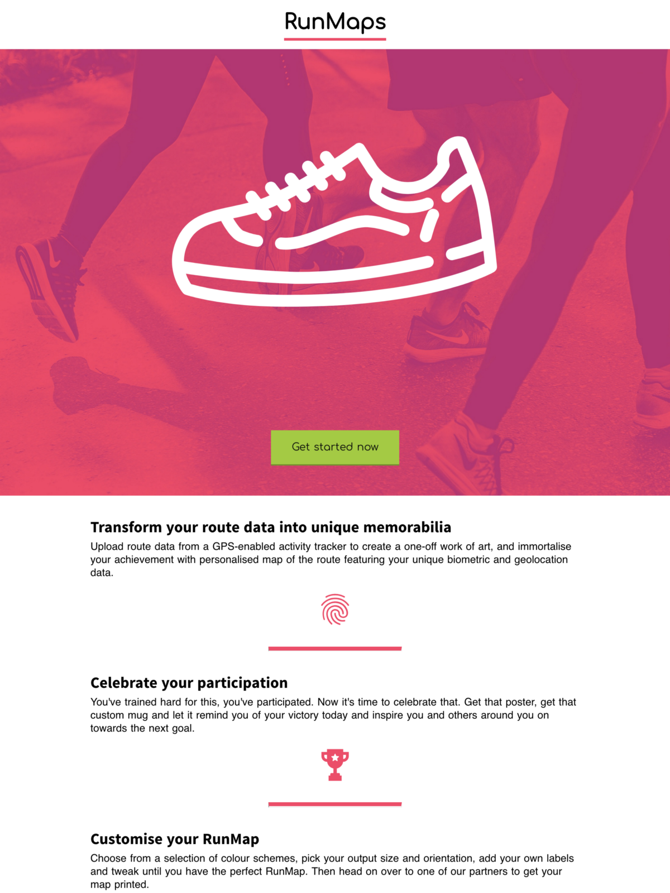
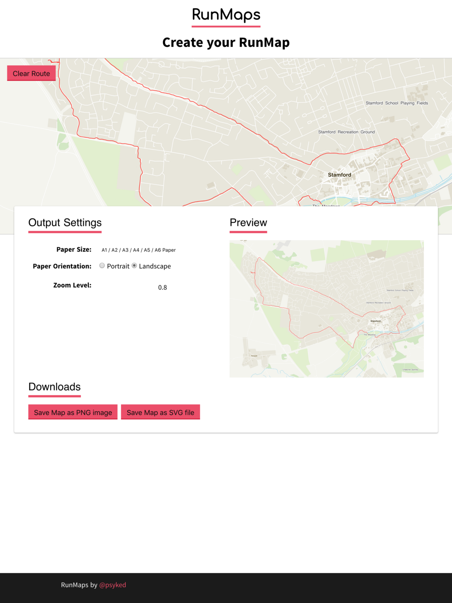
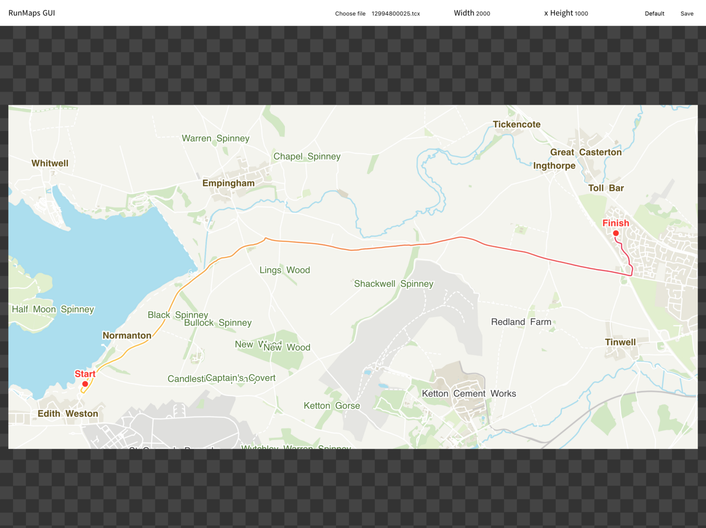
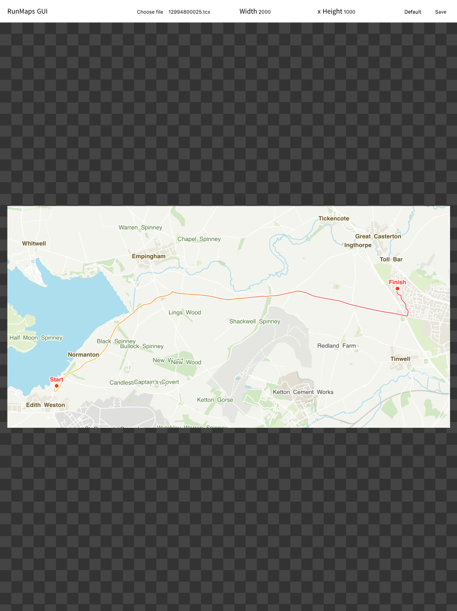
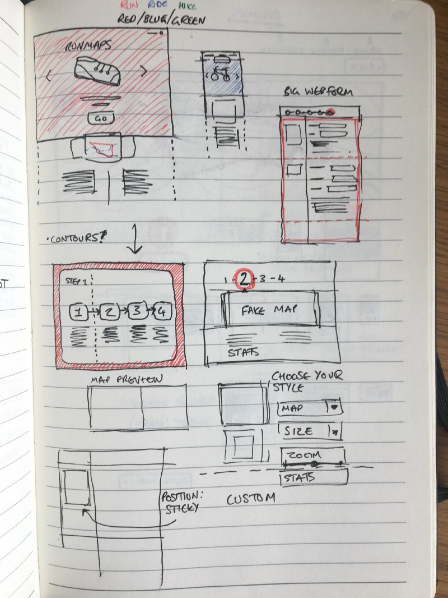
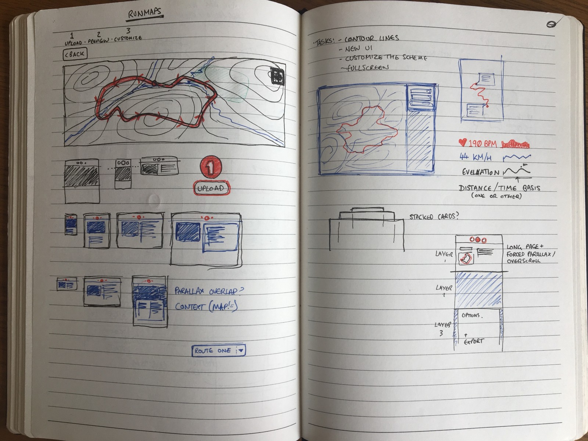

---

# RunMaps #4: Apply UI Sprinkles & Go Live!

## With all this effort spent building RunMaps, wouldn’t it be a shame to not share it with the world?

For all its flaws, I’m happy to say that my first version of RunMaps is online for the world to see at [https://psyked.github.io/runmaps/](https://psyked.github.io/runmaps/)

For posterity, here’s a couple of screenshots of the site as it currently stands, and scroll below for a little more about the reasoning behind all this fancy design work.

---

### Proof of Concept vs. Minimum Viable Product

RunMaps so far has been a Proof of Concept; the full-screen, non-interactive maps described in my previous posts [\[here\]](https://medium.com/@psyked/generating-run-maps-with-node-js-52738014d3dc) [\[here\]](https://medium.com/@psyked/runmaps-v2-0-breaking-free-of-mapbox-dbe3c3ca1a01) and [\[here\].](https://medium.com/@psyked/runmaps-3-colour-schemes-and-labels-d7533eb91bc7) It proves the project concept, but all of the settings and routes are baked into the source code and that makes it a little hard to test with different scenarios or share with any beta testers.

Getting beta testers (or early-adopter customers) ‘on board’ is important because they’re an efficient way of generating the edge-case tests needed to ensure product stability and the most independent way available of validating the journey and testing a customers’ workflow.

#### Enabling Beta Testers: Build an MVP!

When we talk of Minimum Viable Product we’re essentially talking about the simplest possible way of delivering a project. Taking RunMaps from a POC and turning it into a MVP is all about enabling beta testers, making it possible for them to use the tool and help to refine it. Given the scope of what RunMaps does, this essentially translates into adding some basic user interface controls so that users can test and create maps using their own data.

### Minimum Viable Product (MVP)

Users need the ability to upload route data, preview and then save the output that has been generated from that data. It doesn’t need to be any more fancy than that, and anything extra is arguably not delivering any extra value.

Unfortunately I didn’t take any screenshots of the MVP version of RunMaps, but let’s just say the initial MVP for RunMaps was boring. It basically consisted of a file input component, some text inputs for output dimensions, and a button to click to save the output. All done using the default HTML component styling.

A couple of screenshots of the not-quite-so-ugly interim version of RunMaps.

#### Sometimes an MVP is not enough.

When it actually came to getting beta testers on board, I had to explain exactly how to use the application and what it was supposed to be doing, and I had to repeat this for every new user.

What I really learnt from this process is that you can take ‘Lean UX’ too far. A project needs to be self-explanatory enough to stand on its own, and appealing enough to not put off new customers. To tackle this challenge, I decided to go back to pen and paper, and get stuck into some designs, to understand what a Minimum Loveable Product might look like.

### Minimum Loveable Product (MLP)

It’s easy to get ‘stuck in a rut’ and lose the grand perspective when you spend all of your time working with code. I wasn’t happy with how the interface looked, my users weren’t finding it very exciting to use, and development velocity was dropping because I had no clear idea of how the product should look or feel. In short, I had no product Vision.

To come up with a Vision for RunMaps, it was time to ditch the code entirely, grab a pen and paper, and start re-imagining the end goal.

Doodles from the ever-present notebook of ideas.

Spending some time away from the code seems to have the desired effect, giving me the break I needed to reconnect with my original idea for RunMaps and bridge the gaps between POC, MVP and MLP.

---

I have many more topics I’d like to write about which have influenced my development of RunMaps, but I’ll save those for another day and instead encourage you to check it out at [https://psyked.github.io/runmaps/](https://psyked.github.io/runmaps/)