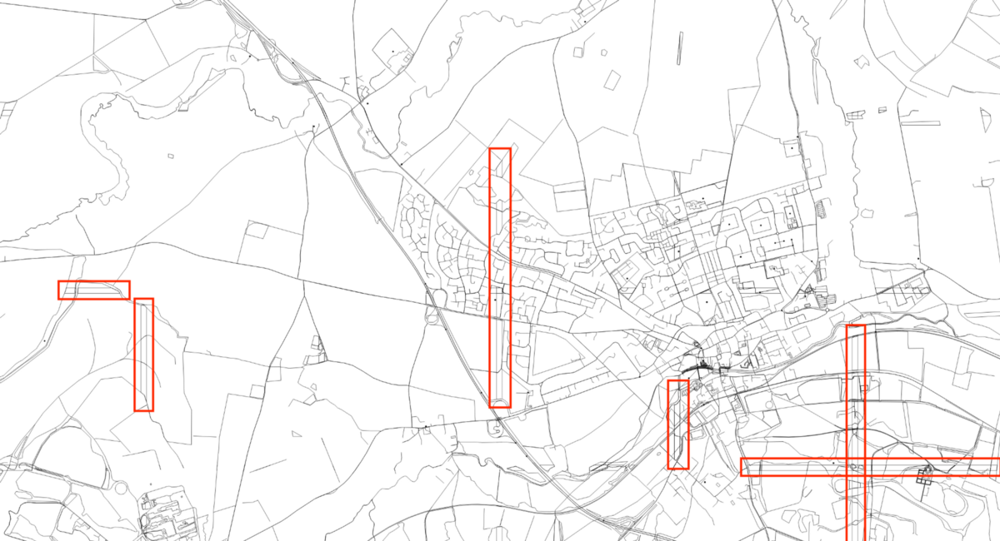
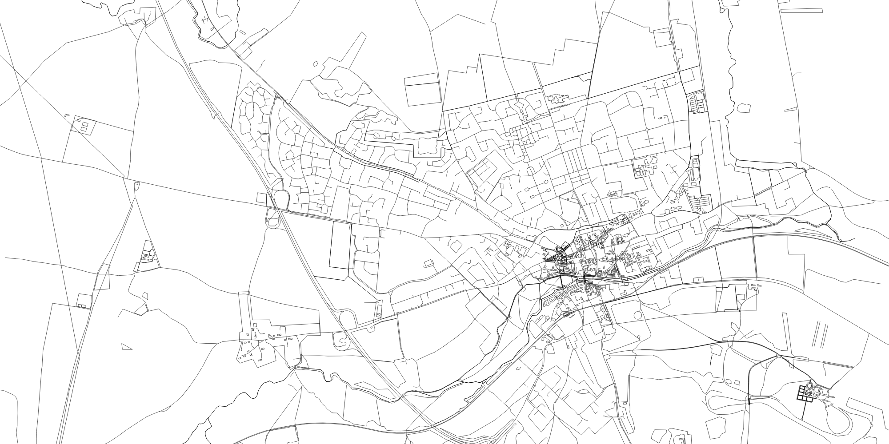

In my previous post, [‘Generating Run Maps with Node.js’](https://medium.com/@psyked/generating-run-maps-with-node-js-52738014d3dc), I talked through the winding path that eventually led me to a place where I’d hooked up data from my activities on Fitbit with data from the Mapbox APIs and created a scalable vector image representation of my activity. It’s been a few weeks since that last post, I’ve had the opportunity to develop this project further, and now I’m going to talk about the next significant change; _dropping Mapbox._

#### Why drop Mapbox?

[Mapbox](https://www.mapbox.com/) is pretty neat, but it’s an entire ecosystem of tools geared towards delivering custom styled maps, and I wasn’t really using it correctly. All I actually wanted was GeoJSON data representing an area, and I got that by unpacking their APIs and then stitching and re-rendering the content myself. It was a rough solution based on what I understood at the time, but when I started reviewing the end result it became apparent that something wasn’t right with the data I was receiving.

Take a closer look at this image, and you’ll see a few problems — which I’ve outlined in red — that come with the approach of stitching together SVG tiles:

Invalid / cropped area shapes from Mapbox API responses.

Those horizontal and vertical lines are the hard edges of what should be large shapes on the map. In the Mapbox API responses they’ve been cropped and the shapes from adjacent tiles overlap, a behaviour that’s based around the slicing up of the map data into Vector Tiles. That’s a problem for me because I actually want the unadulterated shapes, and I want the ability to style those shapes with semi-transparent colours, which I can’t do that if the shapes are overlapping.

#### Alternative data sources 💡

Fortunately I’ve already been exploring alternative sources of mapping data (more on that later) and deduced that I could probably get all of the data that I need directly from [OpenStreetMap](https://www.openstreetmap.org/) — they even have a public (no login!) way of fetching that data directly from their servers: the [Overpass API.](https://wiki.openstreetmap.org/wiki/Overpass_API)

#### Stepping stones 👟

My efforts bumbling through code so far have left me with the ability to render a map using prefabricated GeoJSON data (aka. the data I get back from the Mapbox API), with the knowledge that I can generate simple GeoJSON objects using GPS coordinates from Fitbit data, and with a strategy for rendering the whole lot as SVG objects in a browser using D3.js.

#### Cutting out Mapbox ✂️

The existing \[Mapbox-powered\] rendering process looks like this:

1.  Load route data from Fitbit
2.  Calculate the map centre point and bounds
3.  Pass the bounds to the Mapbox JS library and let it fetch the MVT response
4.  Unpack the MVT protobuff response and convert it to GeoJSON Tiles
5.  Use D3 to render each GeoJSON tile as an SVG object
6.  Use D3 to position each SVG tile correctly on-screen
7.  Generate a GeoJSON representation of the route data from Fitbit
8.  Use D3 to render the GeoJSON route over the top of the SVG tiles

It works, but it’s a lot of back-and-forth between libraries and is more complex than I’d like. However, substituting Mapbox for the Overpass API gives me the following render process:

1.  Load route data from Fitbit
2.  Calculate the map centre point and bounds
3.  Pass the bounds to the Overpass API
4.  Convert the API response to GeoJSON using the osmtogeojson library
5.  Use D3 to render the single GeoJSON object as an SVG
6.  Generate a GeoJSON representation of the route data from Fitbit
7.  Use D3 to render the GeoJSON route over the top of the SVG tiles

It’s arguably _one less_ step than before, but the key gain here is that the GeoJSON response we get hasn’t been sliced up or cropped in any way, and there’s no tiles to worry about. Naturally there’s a lot that’s changed in the response data; Mapbox does a good job of curating its map information whereas the response from the Overpass API is a little more freeform, but the core details are still the same, which is all I need.

#### Working with The Overpass API

The [Overpass API](https://wiki.openstreetmap.org/wiki/Overpass_API) allows queries to OpenStreetMap using Overpass QL, with an URL such as the one below, which takes bounding box coordinates that define a rectangular area and returns XML for all of the geography and amenities in the specified area.

[https://api.openstreetmap.org/api/0.6/map?bbox=-0.6428667113485337,52.58258428865147,-0.4982212886514664,52.727229711348535](https://api.openstreetmap.org/api/0.6/map?bbox=-0.6428667113485337,52.58258428865147,-0.4982212886514664,52.727229711348535)

The output is an impressive 10Mb of XML data, so I’m not going to include it here, but it includes (a lot of) elements like this:

<way id="250040917" visible="true" version="3" changeset="49132008" timestamp="2017-05-31T10:58:44Z" user="brianboru" uid="9065">  
  <nd ref="2565612416"/>  
  <nd ref="2565612409"/>  
  <nd ref="2565612404"/>  
  <nd ref="2565612402"/>  
  <nd ref="2565612400"/>  
  <nd ref="2565612399"/>  
  <nd ref="2565612397"/>  
  <nd ref="2565612395"/>  
  <nd ref="2565612394"/>  
  <nd ref="2565612392"/>  
  <nd ref="2565612391"/>  
  <nd ref="2565612390"/>  
  <nd ref="2565612388"/>  
  <nd ref="4880073434"/>  
  <tag k="highway" v="trunk_link"/>  
  <tag k="highways_england:area" v="6"/>  
  <tag k="oneway" v="yes"/>  
  <tag k="operator" v="Highways England"/>  
</way>

Of course, that’s not GeoJSON data, which is what I really want. Fortunately there’s already a Javascript module that makes things easy called **osmtogeojson** which I can integrate using the following code:

import osmtogeojson from "osmtogeojson";  
import axios from "axios";

const data = await axios  
  .get(\`https://api.openstreetmap.org/api/0.6/map?bbox=${x0},${y0},${x1},${y1}\`)  
  .then(({ request: { _responseXML_ } }) =\> responseXML);

const osmgeojsondata = osmtogeojson(data);

What does the combined output look like? Much the same, fortunately, except there’s no cropping or tiling mess to worry about. Hurrah! 🎉

Finally, much improved mapping data, without any cropping weirdness!

---

Next up, I’m going to take these SVGs and apply some snazzy styling to make the output look 👌.