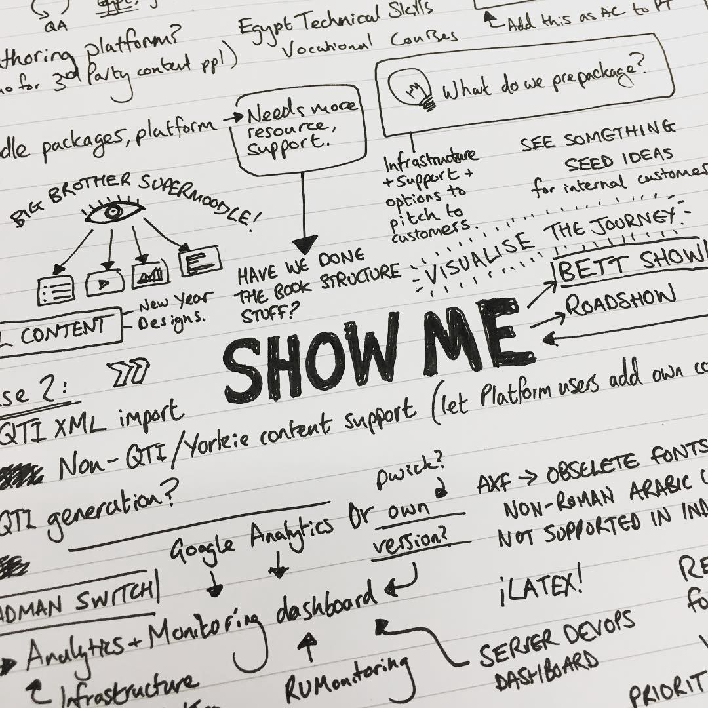

[Image from Unsplash / William Iven](https://unsplash.com/search/sketch?photo=gcsNOsPEXfs)

# Scribbling away during meetings.

I’ve become quite keen on making what’s known as “sketch notes” during meetings and presentations. It’s something that I first encountered a little while ago when I met people at conferences who were making visual notes, but it wasn’t until I really started needing to write extensive notes myself that I gave it a try.

Sketch notes might seem like a slightly more jovial approach to note-taking — and some people will even think you’re simply not paying attention to proceedings and are just drawing doodles — but there’s a little more down-to-earth seriousness to the idea.

Fundamentally we all absorb information in different ways, and we recall and learn in different fashions, and sketch notes tap into our acceptance of that fact. Linear, text-based notes don’t suit everyone and neither would a note-free environment. Some people write notes because they won’t remember things otherwise, and others write specifically because the act of writing them will help them remember.

[TeachThought has a really great article on sketch notes.](http://www.teachthought.com/pedagogy/literacy/10-brilliant-examples-of-sketch-notes-notaking-for-the-21st-century/) To pull a few key quotes from the article:

> _Sketch notes–or graphic notes, or whatever other term you like–are one of the single most important developments in note-taking history._

> _The point of notes \[…\] is to capture important ideas for future reference. While it’s nothing new to take notes that combine images with words and phrases, sketch notes are actually an evolution of this idea._

I would really like to produce beautiful sketches every time I go into a meeting, but it rarely happens. Most of my output is a mess of intersecting lines, repeated underlines/outlines and interconnected boxes, but in the end my notes are not meant to be beautiful — they’re done for my benefit, and because I find the output a useful tool for recapping a subject at a later date.

And yeah, it’s kinda fun as well.

---

_Originally published at_ [_www.psyked.co.uk_](https://www.psyked.co.uk/scribbling-away-during-meetings/) _on January 24, 2017._