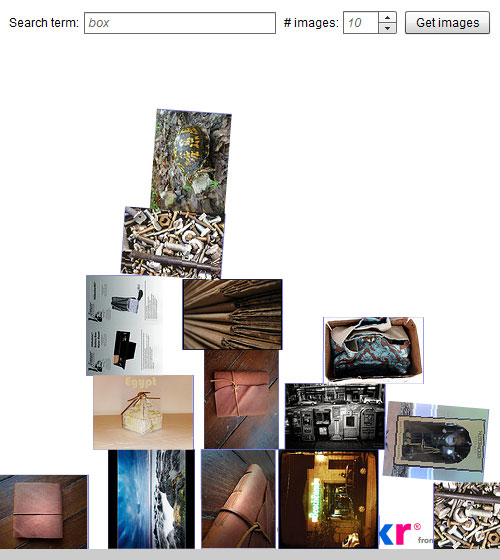

Mark (of [MarkStar.co.uk](http://markstar.co.uk)) has been working away on his pet project "[StarRequests](http://markstar.co.uk/blog/category/starrequests/)" for a little while now, so I thought I'd give it a whirl and see what he's come up with - and of course, what I could come up with off the back of it.  This is the result; a Flickr image loader, with a smidge of Box2D mixed in to make it all seem more interesting.

\[kml_flashembed movie="http://uploads.psyked.co.uk/2010/06/Main.swf" height="560" width="500" /\]

All of the code for this demo, along with a few others, are available from [GitHub](http://github.com/psyked/StarRequests-Examples), and for those unfamiliar with GitHub, [here's the Zip archive](http://github.com/psyked/StarRequests-Examples/zipball/master). While we've some time, let's run through some key elements of this sample:

## The demo:

If you can't see the demo, for whatever reason, I've stuck an image of it below this paragraph.  There's a search term box, a numeric stepper for the number of images, and a search button.  When you click 'Get images' it performs a search on the Flickr API, which returns a list of images.  I'm then using the StarRequests library to sequentially load the images from Flickr, and throwing them into Simple-Box2D to display them in a funky interactive way.

### StarRequests

It's probably more of a micro-framework at the moment, but StarRequests is designed to make it easy to perform a series of actions (requests) that can be queued or batch-executed in a way that's portable between projects.  It's designed to deal with common tasks, like loading a remote URL and extracting the BitmapData, while also abstracting their inputs and outputs to make it possible to mix request types in a single queue.  And queueing is important a lot of the time, because trying to do everything simultaneously often ends with snarl-ups and complex queue management.  With a properly constructed StarRequest class, the systems you so often write and rewrite for different projects are much more portable.

For this example I had to write a complete StarRequest class to load images from Flickr - and that's all it does - but on the plus side I didn't have to touch the queuing system, I now have a reusable Flickr image loader class that I can use again in the future, and I also know that elements, like the queuing system, are a solid base to work from.  There's more tasks going on in this example that I could extract into StarRequests format, but that's a task for another day.

### Simple-Box2D

A little side-project of mine, [Simple-Box2D](http://www.psyked.co.uk/category/box2d) is a set of classes that ease the learning curve between ActionScript and Box2D style code.  It's in dire need of some new functions, cleanup and most of all, code commenting.  Sorry about that.  All this is doing is taking the final Bitmap objects returned from the StarRequest classes, and using their dimensions as the basis for new objects in the Box2D world.

### Flickr

I'm making use of the excellent [as3flickrlib](http://code.google.com/p/as3flickrlib/) classes to interact with Flickr, and then adding a bit of url stitching in the StarRequest classes to create the references to the actual image files (because the API doesn't return that data).

... that's all folks.  Comments appreciated - I know this isn't much of a tutorial, I shall have to conspire with Mark and see if we can get one created.