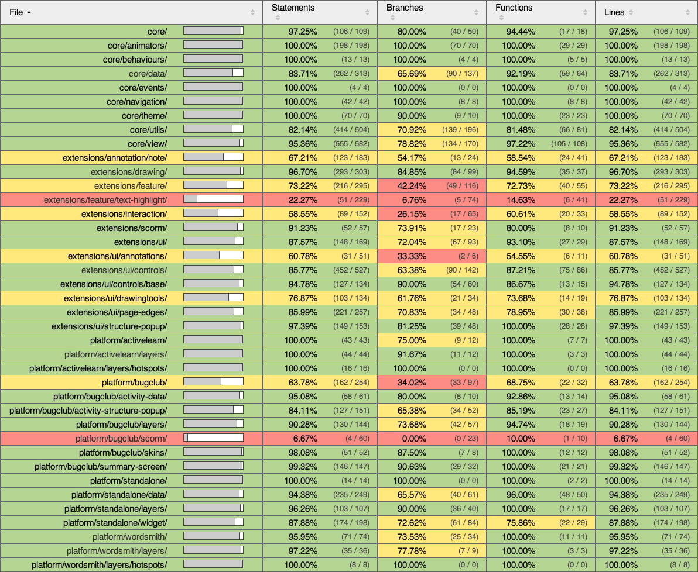

# The 6 Deadly Sins of Unit Testing

---

Not _all_ of the traditional ‘7 deadly sins’ that we know and love apply to such abstract concepts as Unit Testing, but a fair few of them _do_ apply and they plague us regularly in our efforts to create effective, useful tests for our source code. And much like the original 7, recognising and understanding ‘the enemy within’ helps us avoid falling into the same old traps.

So without further ado, here’s my 6 Deadly Sins of Unit Testing:

*   Gluttony
*   Sloth
*   Pride
*   Vanity
*   Ignorance
*   Wastefulness

  

## Gluttony

> “We can’t test _just_ that fragment — we have to test the _whole_ process.”

---

> Your tests are bloated. They take _ages_ to execute or they only actually ‘test’ a section of your code as a side-effect of running another function.

If that sounds familiar, it means your code needs refactoring, abstracting or restructuring. Alternatively, it means that your test is actually an [_E2E_](http://en.wikipedia.org/wiki/System_testing) or [_Integration_](http://en.wikipedia.org/wiki/Integration_testing) test instead of a true [_Unit_](http://en.wikipedia.org/wiki/Unit_testing) test.

Bloated tests are often a symptom of not following a Test Driven Development (TDD) approach to your coding and a sign of poor, non-modular code structures with too many interdependencies.

Such tests lack an inherent focus, and a lack of focus means that your tests will suffer from more false-positives. Getting false-positives in your tests, and having them fail for reasons unrelated to what you’re trying to test, is unhelpful for a developer because it rarely gives you a good indication of the true issue. In most cases you’ll have multiple — unrelated — tests failing simultaneously, with most of those failures having no true connection to code you’re trying to test; and those multiple failures will be disguising the one or two _useful_ tests that point you in the correct direction.

And of course, bloated tests are slower and more resource intensive. An ideal testing environment is one where we have instant feedback as we code. If your tests are bloated, the likelihood of being able to have that instant feedback is much reduced.

  

## Sloth

> “Unit Tests are extra work. I don’t like extra work.”

---

Slovenliness and the absence of unit tests usually boils down to one of two scenarios; the first being that in short, you’re too lazy to write unit tests. Well, let’s assume that’s not strictly true. You _do_ want to write those unit tests, but you just can’t figure out how to make them work. _Believe me, I know the feeling._

The second scenario is that the lack of unit tests is an indicator that the principles of Test Driven Development aren’t being followed, indicating also that there’s a lack of upfront planning, and perhaps that it’s one of those times when you’ve jumped straight into the code without an idea of how you’re going to solve the problem ahead of you when you start.

> Unfortunately for the lazy developer, the solution to absent or untestable code is perseverance and planning — the opposite of laziness!

Learning to make tests that work reliably and effectively is a skill as important as learning to code. Adopting upfront planning isn’t a magic bullet that will help you write effective tests, but refactoring can be the cure-all solution that transforms ugly code into well-structured code.

  

## Pride

> “My code is perfect, it’s never going to change, so it doesn’t need tests.”

---

> No matter how perfect your code is for its intended purpose, it’s limited by just that — it’s _intended_ purpose. And nobody sticks to using it for just what you intended.

Your tests only follow the ideal scenario, and ignore invalid data and edge cases. You make the mistake of assuming requirements are never going to change. _Oh, how foolish you were._

In these scenarios, you might as well have not written your tests in the first place. By only testing how your code behaves when you give it the data _it wants_, you’re failing on many levels:

1.  Your tests won’t detect failures caused by invalid data in the real world, and thus they won’t help prevent those errors from reaching the live environment.
2.  Edge cases and invalid data are essential methods for exploring the limitations of your code, and it _should_ deal with it in a way that’s appropriate. Unit tests are a way of ensuring that you’ve planned for those limitations.
3.  Just as your tests serve to document how your code is designed to work, they should also document how it should behave when given invalid data — and that’s going to be invaluable in the future.

Being too _Proud_ of your code means that you’re not looking closely at its limitations, and that you’re making assumptions about the future requirements. In the real world your code needs to be robust _and_ flexible, and you need your tests to make ensure that’s true of your code.

  

## Vanity

> “I have over 200 unit tests for my code, I don’t need any more.”

---

Measuring the effectiveness of your unit tests is a tricky thing. Do you go for your gut feeling? Do you count the total number of tests you’ve created? How complex do your measurements have to be to properly judge that you’ve tested enough of your code?

We often turn to things like Code Coverage — a metric that we can use to specifically measure which areas of our code are being executed during testing and thus judge which areas are in need of additional testing.

Code Coverage statistics — like Unit Tests themselves — are an indicator of quality code. If you have the stats, then you probably have the quality code.

> What constitutes ‘enough’ tests is reliant on your judgement, and it’s all too easy to get suckered in by numbers alone.

Never assume that you have enough tests, or that simply achieving the fabled 100% Code Coverage statistic is going to be enough. Keep adding to the tests and expand your scenarios as new things crop up. Likewise you should also not assume that acheiving and maintaining 100% code coverage is going to solve all of your problems. All in all,

> Your statistics are not the only measure of success, so don’t get obsessed with them.

  

## Ignorance

> “I didn’t write that code, so I don’t need to test any of it.”

---

There’s a natural separation between the code that you’ve _written_ and the library or 3rd party plugin code that you’re _using_ in your project, and with that comes the obvious border between what you _should_ and _shouldn’t_ be testing.

The difficulty comes with the integration points between that externally developed code and your own. It’s easy to assume that other people’s code is stable and well-tested, but maintaining a willful ignorance because of that and not validating your expectations of their code can lead to more unexpected code _weirdness_.

> You can still have ‘Black Box’ code in your project and be ignorant of how it works, so long as you remember to test the point at which it’s integrated with your own.

  

## Wastefulness

> “I have loads of tests that all essentially say the same thing.”

---

Pointless tests, duplicated tests, and tests that essentially all say the same thing. Sound familiar? _Wasteful_ testing has a tendency to be a side-effect of your own _Vanity_ in pursuit of the elusive ‘code coverage’ statistics or overall ‘number of test’ targets.

In one sense, it’s logical to be incremental in your development. On the other hand, if an entire test or test suite fails on a single assertion, does it really matter if it’s failing because a single specific check fails or because several vague ‘incremental’ checks fail? Or put it this way; would you rather work with (and crucially, maintain) tests like this:

check('expected api', function() {  
    ...  
    expect(obj).toBeDefined();  
    expect(obj).toBeType('object');  
    expect(obj.init).toBeDefined();  
    expect(obj.init).toBeType('function');  
    expect(obj.init()).toBeType('object')  
    ...  
});

Or this?

check('expected api', function() {  
    ...  
    expect(obj.init()).toBeType('object');  
    ...  
});

They’re both going to fail when it comes to that final, specific check. Your verbosity isn’t really helping you at all here.

> ‘_Keep it Lean’_, as they like to say in the Agile world.

---

And there you have it — the six ‘deadly sins’ that undermine our efforts to develop and maintain effective Unit Tests for our code.