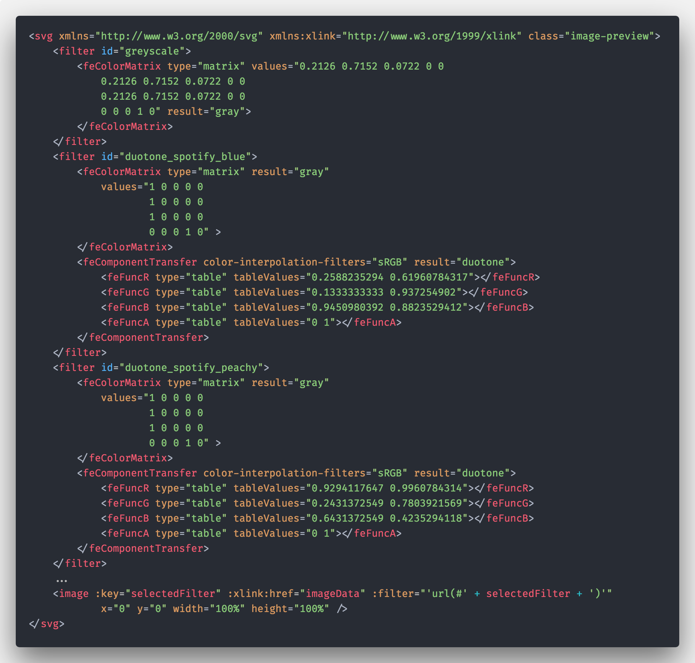
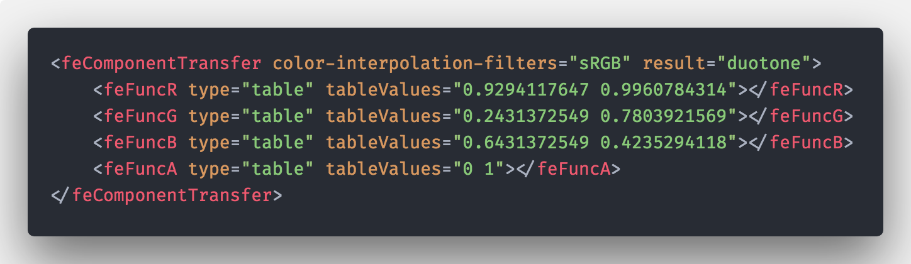
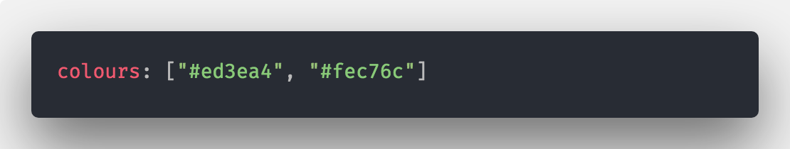
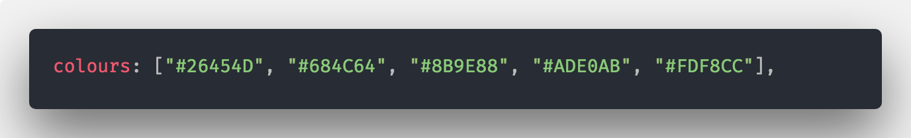
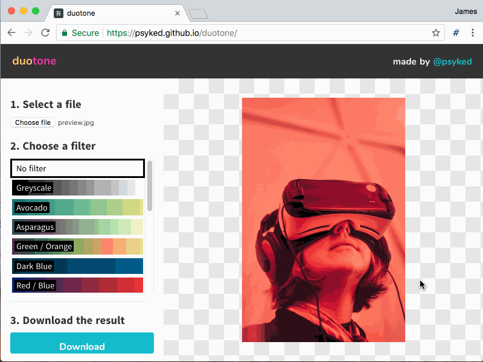

# Version 2

## Refactoring and enhancing an MVP

If there’s one thing I’ve learnt from successful projects over the past few years it’s the value of identifying and building the Minimum Viable Product (MVP) and then enhancing it post-release.

Keeping the project scope narrow allowed me to build and release [Duotone](https://psyked.github.io/duotone/) after a couple of evenings’ effort. [(Read my initial post about Duotone here.)](https://medium.com/@psyked/building-duotone-fc7e0d9a3b9e) I haven’t shown the source code to anyone though, because it’s not exactly portfolio-worthy. However now that the project is publicly-available I can start building up a backlog of enhancement tasks for the core product.

---

Duotone output on the left, Original on the right.

#### More features, or better features?

That’s a trick question really. It’s rarely a good idea to add more features and more complexity to an MVP. It’s the very nature of an MVP codebase to be functional but hideous, so the first task should really one of consolidation and reducing complexity that to make future development easier.

#### Going from Proof-of-Concept to more manageable code

One of the biggest challenges with the current codebase is code duplication — duplication bordering on the unwieldy. Let’s have a look at some source code; truncated, for the sake of sanity, as the actual code is several times longer!

This code is fairly complex, there’s a lot of duplication going on and a lot more SVG markup than actual script. Maintaining this isn’t going to be easy, and the code isn’t awfully readable, so that’s one of the highest priority things to improve.

Looking closer at a small code snippet, we have the following, which splits and remaps RGB colour channels — represented in values from 0.0 to 1.0.

Dealing with colours as individual RGB channels and as values from 0 to 1 like this is unfamiliar, but with a little refactoring work we can make this more readable, familiar and maintainable, so that it looks like this:

The colour values are essentially the same in these two snippets, but the latter one is much easier to manage. Instead of hard-coding multiple SVG filters in our source code we did in the original version, I’ve created a function to generate the SVG markup from the supplied Hexadecimal codes.

Once we can replace our hardcoded SVG markup with Javascript source code values, we can easily extend our filter effects and beyond two-colour transformations, like this:

---

#### User Interface (UI) enhancements

Having simple Hexadecimal colours representing the filters in Duotone suddenly makes new features a whole lot easier to implement. As a UI enhancement I’ve swapped out the filter selection dropdown for a heavily visual list, demonstrating the gradient colours used in each filter.

Version 2 of Duotone, in all its glory.

### Conclusion

An MVP is meant to be rough-and-ready code, which means that your post-release efforts are best focussed on refactoring and consolidating your codebase rather than adding new features.

Refactoring source code and making it more manageable is an enabler for new enhancements, either on the technical or user experience side of things.